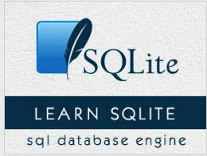

```
Roberto Nogueira  
BSd EE, MSd CE
Solution Integrator Experienced - Certified by Ericsson
```
# TutorialsPoint project



**About**

Learn everything you need to about the subject of this `Tutorialspoint` project.

[Homepage](https://www.tutorialspoint.com/sqlite/index.htm)

## Topics
```
SQLite Tutorial
[x] Home
[x] Overview
[x] Installation
[x] Commands
[x] Syntax
[x] Data Types
[ ] Create Database
[ ] Attach Database
[ ] Detach Database
[ ] Create Table
[ ] Drop Table
[ ] Insert Query
[ ] Select Query
[ ] Operators
[ ] Expressions
[ ] Where Clause
[ ] AND & OR Clauses
[ ] Update Query
[ ] Delete Query
[ ] Like Clause
[ ] Glob Clause
[ ] Limit Clause
[ ] Order By
[ ] Group By
[ ] Having Clause
[ ] Distinct Keyword
Advanced SQLite
[ ] PRAGMA
[ ] Constraints
[ ] Joins
[ ] Unions Clause
[ ] NULL Values
[ ] Alias Syntax
[ ] Triggers
[ ] Indexes
[ ] Indexed By
[ ] Alter Command
[ ] Truncate Table
[ ] Views
[ ] Transactions
[ ] Sub Queries
[ ] Autoincrement
[ ] Injection
[ ] Explain
[ ] Vacuum
[ ] Date & Time
[ ] Useful Functions
SQLite Interfaces
[ ] C/C++
[ ] Java
[ ] PHP
[ ] Perl
[ ] Python
SQL Useful Resources
[ ] Quick Guide
[ ] Useful Resources
[ ] Discussion
Selected Reading
[ ] Developer's Best Practices
[ ] Questions and Answers
[ ] Effective Resume Writing
[ ] HR Interview Questions
[ ] Computer Glossary
[ ] Who is Who
```
